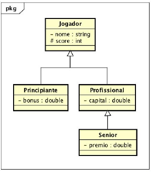

# Programação Orientada a Objetos - Trabalho 5

Considere a hierarquia de classes representado no diagrama acima. Os atributos
são anotados com um símbolo "- " para indicar visibilidade private e com um
símbolo "#" para indicar visibilidade protected. Implemente as classes com os
atributos indicados no diagrama acima e com métodos da seguinte forma:
1. Classe Jogador
    1. Método construtor
    2. void imprimir( ) : imprime todos os atributos do objeto
2. Classe Principiante
    1. Método construtor
    2. void imprimir( ) : imprime todos os atributos do objeto
    3. void ganhar(int p) :
        1. adiciona p ao score;
        2. adiciona 10% de p ao bonus.
    4. void perder(int p) :
        1. subtrai p do score
        2. desconta 10% de p do bonus.
3. Classe Profissional
    1. Método construtor
    2. void imprimir( ) : imprime todos os atributos do objeto
    3. void ganhar(int p ) :
        1. adiciona p ao score;
        2. aumenta o capital de p * 4
4. void perder(int p) :
    1. subtrai p do score
    2. diminui o capital de p * 4
5. Classe Senior
    1. Método construtor
    2. void imprimir( ) : imprime todos os atributos do objeto
    3. void ganhar(int p ) :
        1. chama o método ganhar da superclasse
        2. dobra o valor do prêmio
    4. void perder(int p ) :
        1. chama o método perder da superclasse
        2. reduz o valor do prêmio à metade

Deve ser implementada uma classe adicional denominada Teste contendo o
método main que deverá criar um objeto de cada tipo de jogador (Princiante,
Profissional e Senior) e chamar todos os métodos disponíveis para esses objetos.
